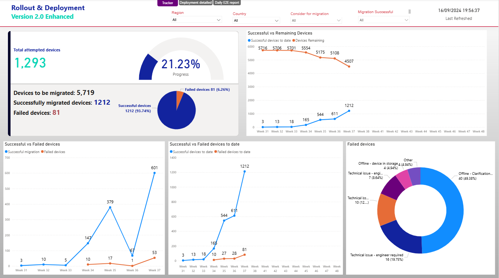

# OMS 2.0 Enhancement Project Tracker  

## **Project Background**  
RICOH is a leading **digital printing and imaging solutions provider**, operating in the print and document management industry for over 88 years. The company’s business model revolves around providing **hardware, software, and managed services** to enterprise clients worldwide.  

The **OMS 2.0 Enhancement and Migration Project** was initiated as part of RICOH’s ongoing commitment to improving **user experience (UX)** and **system integration**. The goal was to modernize and unify printer login methods and user interfaces across a major client’s global printer fleet — encompassing **5,000+ devices** across **20+ country locations**.  

As a **Business Intelligence developer**, I partnered with the project team to design a dashboard solution that provides **reporting and tracking** for project stakeholders, including project managers and client representatives. The dashboard was built to:  
- Monitor the **enhancement process** and **implementation timeline**  
- Observe **weekly trends** in migration success/failure, showcase **migrated vs. remaining devices to date** compared to the whole fleet 
- Track the **overall progress** and identify **bottlenecks** for timely resolution

⏰The solution also to be scheduled for automatic refresh in time for daily project meetings held at *12:00 PM* to review progress, identify issues, and plan next steps.  

 Week 7             | Week 19  
:-------------------------:|:-------------------------:
  |  

### **Data Tools**
- **SharePoint** → Primary data source 
- **Power Query** → Data extraction and cleaning  
- **DAX (Data Analysis Expressions)** → Custom measures and calculated fields  
- **Power BI Desktop** → Interactive dashboard development  
- **Power BI Service** → Online publishing with **daily automatic data refresh**  

---

### **Database Overview**
The main data source for the project was **SharePoint**, maintained daily by the Asset and Project Manager. Each printer’s enhancement status was tracked against the master **Asset List**. The dataset contained approximately **6,000 records** representing individual printer devices, consisted of three parts:  

| **Table Section** | **Description** |
|------------|----------------|
| **Asset List** | Contains all devices under the global account’s fleet, with device identifiers and location details. |
| **Migration Status** | Tracks the migration progress of each device (`To be migrated`, `Migrated successfully`, `Mirgration time` etc.). |
| **Failure Logs** | Logs migration errors and their causes (`Offline`, `Not in System`, `Network Error`). |

---

## **Executive Summary**

### **Overview of Findings**
Over the course of 19 weeks, the OMS 2.0 migration project achieved a **99.24% successful migration rate** across the targeted printer fleet. The most significant jump in attempted and sucessful device happened after week 10 (week 41 calendar year), from 83 to 792 sucessful enhancement (~854% ⬆️increase), we can see 72% of the project was done within the last 7 weeks due to offices back from summer holiday and increase in communication and cross-function synergies. The majority 77% of the client's fleet is located in EMEA region which is also the region with the highest failed migration, the main challenges were **offline or unregistered devices**, requiring follow-up with local IT teams rather than technical.

---

## **Insights Deep Dive**

### **Project's current status and Snapshot**
A combined **card visuals** provides a snapshot of key performance metrics:
- Total devices in migration scope  
- Total attempted migrations  
- Successful vs. failed migrations  
- Current week’s progress  
These summary cards give stakeholders a **quick project health check** during daily meetings.

---

### **Enhancement Trend**
 Successful vs. remaining devices             | Weekly and Accumulated Status
:-------------------------:|:-------------------------:
 | 
---

### **Failed Devices and Reasons**
A **pie chart visualization** illustrates the top causes of failed migrations:
- **Offline Devices** (most frequent issue)  
- **Devices not listed in the client’s system**  
- **Network accessibility issues**  

This breakdown allowed the team to **prioritize troubleshooting efforts** and communicate with local site managers for resolution.

---

## **Recommendations**
**Improve Migration Speed**  
   - Consider project timeline during planning phrase to avoid holiday season and lack of communication.

2. **Reduce Migration Errors**  
   - Implement automated pre-check scripts to validate device connectivity and registration prior to migration. Cut time spend on locating offline devices and waiting for response.

3. **Enhance Data Governance**  
   - Maintain consistent SharePoint data formatting and enforce data entry validation rules. Ensure mandatory columns remain unchanged and correctly filled in.

---

## **Assumptions and Caveats**
- The **SharePoint Asset List** was assumed to be complete and up to date.  
- **External factors** (e.g., holidays and a one-week project pause) were excluded from migration efficiency KPIs.  
- The **database structure** was maintained consistently by Asset and Project Managers throughout the project.  

---

*Authored by: Minh Nguyen — Business Intelligence Developer, Data Analyst*  
*Linkedin: www.linkedin.com/in/minh-n-nguyen*
